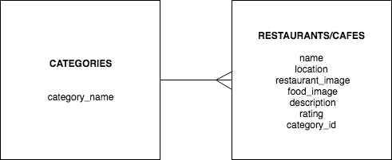
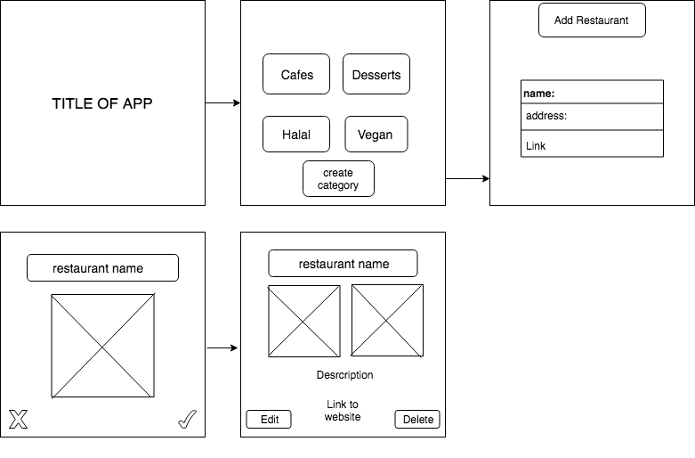

# PROJECT 4

### App Description
- This app is tinder style restaurant app where users can choose a category of food: vegan, cafes, halal, or desserts. Clicking on the categoty will show restaurants from that category. The user can either tap yes or no on the restaurant. Clicking "No" will automatically show the next restaurant, and cliking "yes" will show more info about the restaurant, with a link to the actual restaurant's website. 

### Feature List
- This app is geared towards an individual who doesn't know what they want for lunch/dessert, or wants to find a new cafe to grab coffee from. The app is super simple so the user can just look at the options and decide quickly. User can also add/edit/delete restaurant options.

### ERD

### Wireframes

### Project Timeline
- Monday: complete backend, create a database with about 5 restaurants per category
- Tuesday-Friday: Front end  

### Technologies Used
- This app will be built with a ruby on rails backend, and a react front end. 

### MVP
- App will show at least 4 categories as the landing page. Clicking on each category will show all the restaurants from that category, with one restaurant taking up the entire screen. If the user clicks yes, more info is shown about the restaurant. If no, then another restaurant is automatically shown. User can also add/edit/delete restaurants.

### Component Hierarchy
- Home
    - Categories
        - Restaurants
            - moreInfo
        - CreateRestaurant
        - UpdateRestaurant
        - DeleteRestaurant
    - Create Category
    

### Post MVP
- There will be a save button on each restaurant so that the user can look at a saved list of restaurants. 

